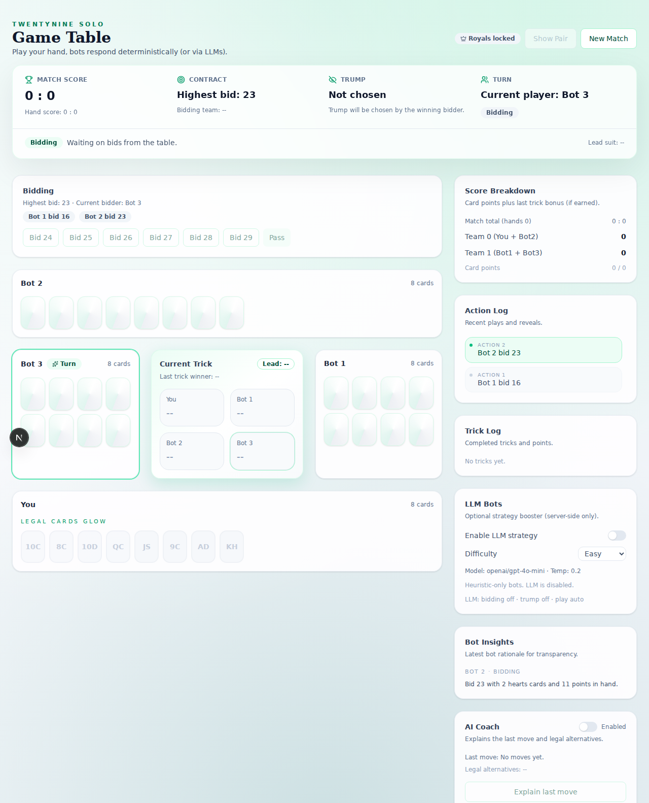

# TwentyNine

TwentyNine is a solo-first, modern take on the classic Bengali trick-taking game 29. It is a felt table you can open in seconds, with AI tablemates that think in real time and a coach that explains your last move while the hand is still warm.



## Why it feels different

- It is built for flow: legal moves only, clear turn cues, and a log that tells you what just happened.
- The bots can be LLM-driven. When enabled, they reason over legal moves every turn and play to the contract.
- The coach is on demand: one tap and you get a concise review of the last play plus better alternatives.
- Under the table, the rules engine is deterministic and serializable. Given the same state and action, it will always produce the same next state.

## The game in 60 seconds

- 32-card deck (7 through A in each suit).
- Rank order: J > 9 > A > 10 > K > Q > 8 > 7.
- Point cards: J=3, 9=2, A=1, 10=1 (28 total) plus a last-trick bonus for a total of 29.
- Players must follow suit if possible.
- Trump stays hidden until a player cannot follow suit, then it is revealed and trumps start to win tricks.
- Royals (Pair): K+Q of trump can be declared after trump is revealed and your team has won a trick; it adjusts the contract by +/-4 with floor/cap.

## AI tablemates and a coach

- LLM bots are optional and run through OpenRouter. Each bot move is selected from legal moves only; if the model fails, a deterministic heuristic is used.
- AI Coach analyzes the last move and suggests alternatives with short, actionable feedback.

## How it works (under the hood)

- Engine: pure TypeScript state machine in `packages/engine`.
- UI: Next.js app in `apps/web` that enforces legal moves and renders the table.
- AI: a server-side `/api/openrouter` route brokers bot and coach calls.

## Quickstart

```bash
pnpm install
pnpm dev
```

Open `http://localhost:3000/game`.

## Optional AI features

Create `apps/web/.env.local` and set:

```
OPENROUTER_API_KEY=your_openrouter_key_here
```

## Status and roadmap

Current status: v0.4. The core solo hand flow is playable with deterministic scoring, trump reveal, royals, AI bots, and an AI coach. The UX is solid but not yet polished to a professional finish, and LLM tuning is ongoing.

Planned next steps:

- Richer bidding phase with player-selected trump.
- Seventh-card trump variant.
- Single-hand variant (play alone with no trumps).
- Joker indicator for no-trumps.
- Better bot strategy and deeper coaching.
- Multiplayer (authoritative server state, rooms, reconnection).
